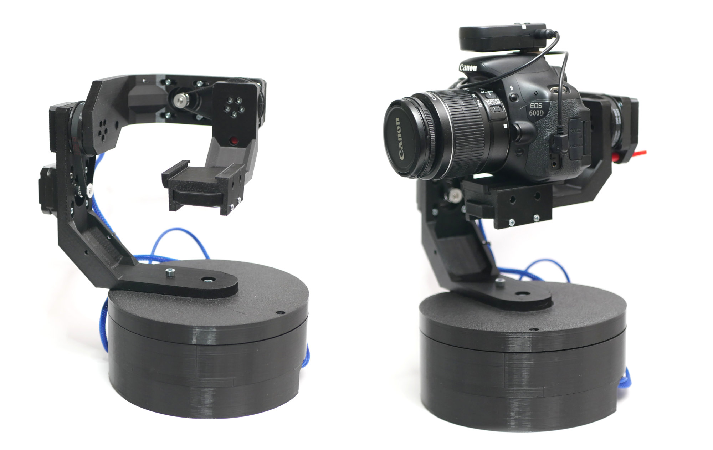
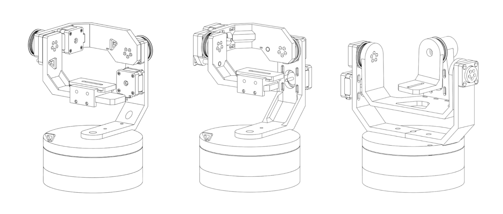

###StarTracker - 3 axis astrophotography tracking solution

**Project is still in development and it may change!** 
Welcome to the StarTrckr project, an innovative solution to the problem of tracking in astrophotography. The goal of this project is to get over the limits of conventional tracking techniques so that hobbyists and enthusiasts can more easily take beautiful pictures of the night sky. Additionaly this construction enables for easier tracking of other objects (for example satellites) but the feature is not implemented yet.

A further benefit of the design is that it can be completely 3D printed, making it simple for everyone to construct and modify their own tracking device. It is planned to design an additional pro version that features steel parts for increased stiffness of the construction but 3D printed version will always stay as the bassis thats accesible and easy to replicate for everyone.

Since he was a young child, Nikodem Bartnik, the project's creator, has been fascinated about observing the night sky and space in general.  He is constantly searching for new ways to enhance the system and make it easier to use for users of all levels. At the same time he is into developing various open source projects and documenting the journeys of creating them on his YouTube channel. Additionaly is a part of Silesian Aerospace Technologies science club where together with friends he develops high altitude balloons, rockets and cubesat subsystems.

Designed by [Nikodem Bartnik](https://www.youtube.com/nikodembartnik). 

##Mechanics
Different design approaches have been considered and in the end multiple designs were created. Some of those are presented in the image below.

Most parts have been 3D printed and only a few additional parts like bearings, screws and motors are neccesary from the mechanical point of view. As of writing this readme there are three versions included in CAD folder (v2, v3 nad v4). At this point v3 is prefered version and the one that is currently tested. Following list of printed parts reffers to v3.
| Name                | Amount |
|----------------------|-------|
| arm1.3mf             | 1     |
| arm2.3mf             | 1     |
| arm3.3mf             | 1     |
| base_pcb_box.3mf     | 1     |
| base_motor_holder.3mf| 1     |
| base_gear.3mf        | 1     |
| base_bearing_cap.3mf | 1     |
| base_gear_small.3mf  | 1     |
| gt2_pulley.3mf       | 2     |
| shaft.3mf            | 2     |
| shaft_cap.3mf        | 2     |
| bearing_flap.3mf     | 2     |
| quick_release_plate.3mf| 1   |
| quick_release1.3mf   | 1     |
| quick_release2.3mf   | 1     |
| pin.3mf              | 3     |

List of additional parts needed for the mechanical assembly:
| Name                | Amount | Description 
|----------------------|-------|-----------|
| Stepper motor 17HS08-1004S | 3     | Pancake type stepper motor, height: 20mm |
| 6205 bearing             | 2     | ball bearing |
| 6804 bearing             | 2     | ball bearing |
| GT2 belt 200mm          | 2     | 6mm wide    |
| GT2 pulley              | 2     | 16 teeth    |
| M6x60 screw             | 1     |  |
| M6 nut                  | 1     | |
| M5 screws               | a lot | lengths and amounts depend a lot on the version you are building |
| M5 nuts                 | a lot | |
| M3 screws               | a lot | lengths and amounts depend a lot on the version you are building |
| M3 nuts                 | a lot | |
***

## Electronics

## Open Source
The StarTracker project is open-source, and the author welcomes feedback and contributions from the community. They believe that by sharing the project, they can help others to achieve the same level of success in capturing images of the night sky. If you are interested in building your own StarTrckr, the project's Github repository includes detailed instructions and all the necessary files to get started. Project was created as a bachelor thesis project at Silesian University of Technology and the created thesis can also be found in the repository as a PDF where one can read in depth about the research, problems and detailed explantion about the design process and decisions. 

## Parts

## Build Instruction
- todo 

## Project logo
 

  

We hope you enjoy using the StarTracker and are able to capture stunning images of the night sky with it. The StarTracker project is an ongoing effort, and the author is always looking for ways to improve it. Feel free to contact the author or contribute to the project if you have any ideas or suggestions. Together, we can make astrophotography more accessible and enjoyable for everyone.